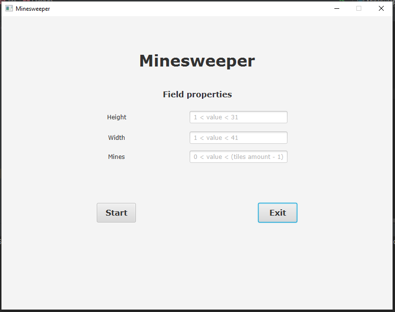
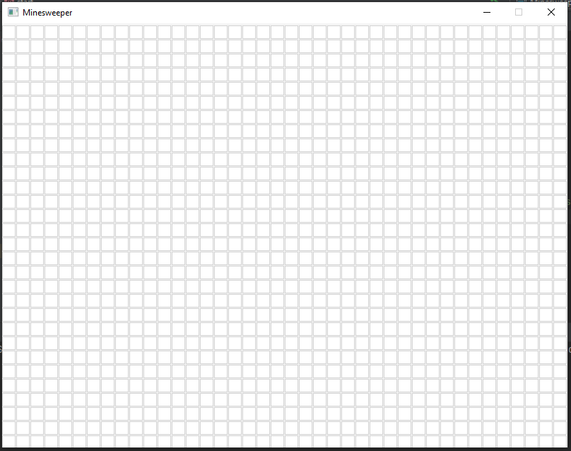
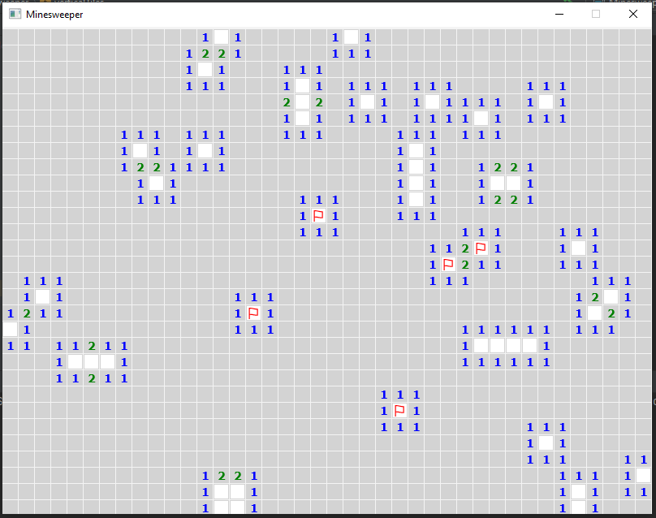
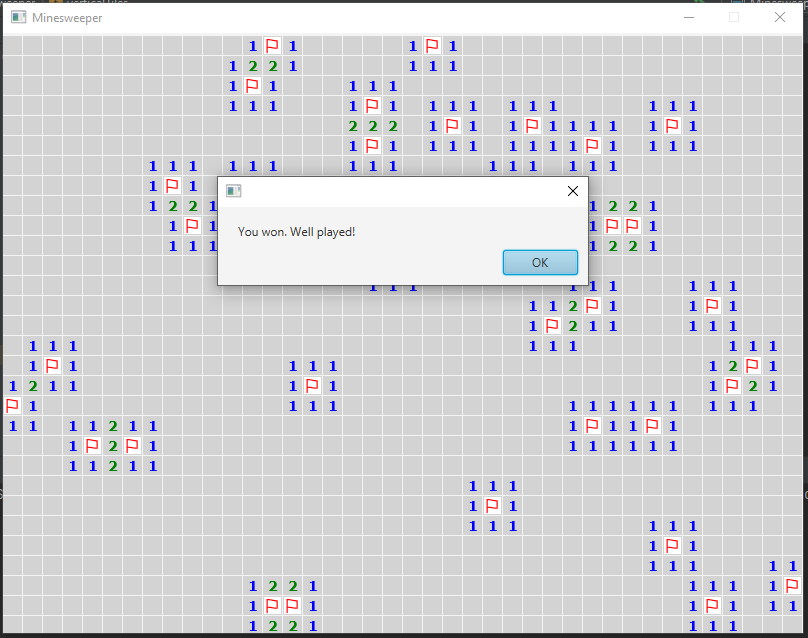

# Minesweeper

Minesweeper is a single-player puzzle video game. The objective of the game is to clear a rectangular board containing hidden "mines" or bombs without detonating any of them, with help from clues about the number of neighboring mines in each field.

# Requirements

## For Game
• Computer Mouse
## For Source Code
### Download Java Development Kit (JDK)
#### https://www.oracle.com/java/technologies/javase-downloads.html

### Download the JavaFX SDK:
#### https://gluonhq.com/products/javafx/

### Add JavaFX library:

#### File -> Project Structure -> Libraries -> add library 
#### path->C:\javafx-sdk-15.0.1\lib (will depend)

### Add VM Options:
#### Run-> Edit Configuration -> modify options -> add vm options
#### --module-path %PATH_TO_JAVAFX_SDK/LIB% --add-modules javafx.controls,javafx.fxml 

## For Release

### Download Java Runtime Environment (JRE)
#### https://java.com/en/download/manual.jsp

# Screenshots

## Menu

## Game #1

## Game #2

## Game Won

# References
Recursive algorithm of counting and opening nearby cells based on this YouTube video: https://www.youtube.com/watch?v=JwcyxuKko_M

# Authors
## Tilek Toktorov and Eldiiar Dzhunusov
 

 

